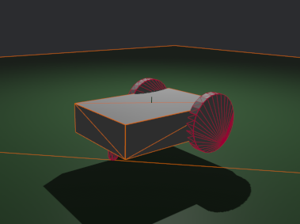

# bevy_serialization_urdf

An addon for bevy_serialization_extras to enable urdf support

## To use

see `sample_robot_load.rs` in `/examples`

## Features

Visualization of urdfs

physics simulation of urdfs through `bevy_serialization_physics`'s wrappers.
